# Oclaw 智能运维 — Oclaw + netx 运维专家介绍

> 证据驱动 · 告警闭环 · 多渠道触达 · 可编排自动化

---

## 1. 整体定位

**Oclaw** 是自托管的多专家 AI Agent 平台，提供 Admin、Chat 以及微信/WhatsApp 等渠道接入。

**netx** 是告警-centric 的网络运维平台，负责 UME 告警同步、网元纳管与只读 CLI 执行。

**运维专家（ops specialist）** 是 Oclaw 中的网络运维角色，对外 persona 为「**oclaw智能运维**」。它与 netx 深度集成，形成「数据面 + 推理面」的完整运维闭环。

| 项目 | 角色 | 核心职责 |
|------|------|----------|
| Oclaw | AI 交互与编排层 | Agent 推理、工具调用、Skills、渠道回复 |
| netx | 数据与设备执行层 | 告警采集/查询、网元纳管、安全 CLI |
| 运维专家 | Oclaw 中的 ops 专家 | 查告警、诊断网元、生成报告、触发自动化 |

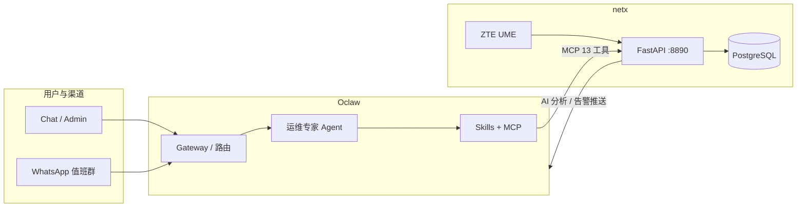

---

## 2. Oclaw 平台概览

### 2.1 用户入口

- **Admin**：`http://127.0.0.1:8787/admin` — 配置 MCP、专家、渠道、模型
- **Chat**：`http://127.0.0.1:8787/chat` — 与专家对话
- **渠道**：微信、WhatsApp、企微等，可绑定默认专家

### 2.2 专家体系

| specialist | 说明 |
|------------|------|
| **ops** | 网络运维专家（本文重点） |
| generalist | 通用任务 |
| memory | 知识/记忆 |
| image / video / stock | 专项能力 |

### 2.3 交互模式

- **expert**：用户直连某一专家（如 ops）
- **comprehensive**：经理 Agent 编排，按任务委派给 ops 等专家

### 2.4 分层架构

```
runtime/        Agent 循环、路由、Skills、调度
interfaces/     HTTP/WS、Admin UI、Gateway
platform/       配置、持久化、LLM 传输
tools/          专家工具、公共工具、MCP 适配
skills/         可安装技能包（SKILL.md）
```

### 2.5 消息处理流程

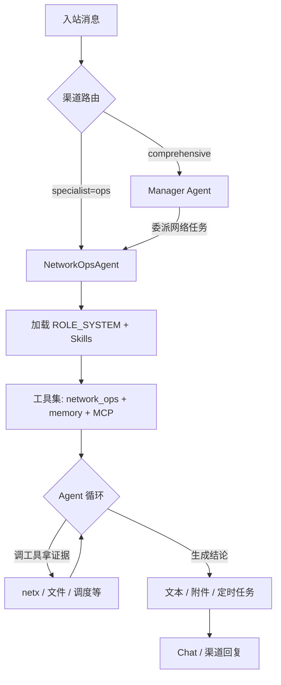

---

## 3. 运维专家（Ops Expert）

### 3.1 身份与实现

| 项 | 值 |
|----|-----|
| specialist ID | `ops` |
| 对外名称 | oclaw智能运维 |
| 工具包 | `network_ops+memory` |
| Agent 类 | `NetworkOpsAgent` |
| 角色定义 | `runtime/workspaces/ops/ROLE_SYSTEM.md` |

### 3.2 核心原则

1. **证据优先** — 先用工具查日志、状态、配置，再下结论
2. **变更安全** — 破坏性操作需明确影响范围与回滚方案
3. **可验证输出** — 结论 → 证据 → 最小修复步骤
4. **网元展示** — 一律以 `host_name` 为主键，禁止对用户展示 UUID `ne_id`

### 3.3 工具来源

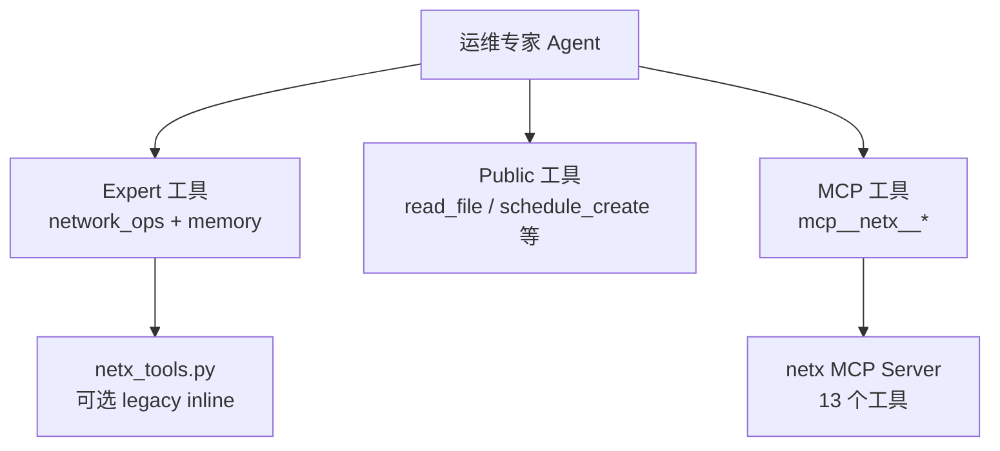

---

## 4. netx 平台概览

### 4.1 定位与技术栈

netx 是面向 ZTE UME 环境的网络运维平台（v0.2），提供 Web UI、REST API 与 MCP 接入。

| 组件 | 技术 |
|------|------|
| 后端 | Python 3.11+ / FastAPI / PostgreSQL / Netmiko |
| 前端 | React 19 + Vite |
| 默认端口 | API `:8890`，Web UI `:5173` |

### 4.2 数据来源

- **主路径**：UME RESTCONF + WSS 实时订阅（当前告警、网元清单）
- **兼容路径**：ZTE Alarm Monitor Excel 导入

### 4.3 核心模块

| 模块 | 路径 | 能力 |
|------|------|------|
| UME 同步 | `netx_api/ume_sync_service.py` | 告警/网元定时与实时同步 |
| 只读 CLI | `netx_api/ne_exec.py` | 安全的 show/display/ping 执行 |
| 纳管网元 | `netx_api/managed_ne_router.py` | SSH/Telnet 设备 CRUD、跳板机 |
| MCP 代理 | `packages/netx-mcp/` | stdio → HTTP，不直连数据库 |
| Oclaw 桥接 | `netx_api/ap_client.py` | AI 分析回调 |
| 告警推送 | `netx_api/oclaw_alarm_forwarder.py` | 关键告警 WebSocket 转发 |

### 4.4 netx 内部架构

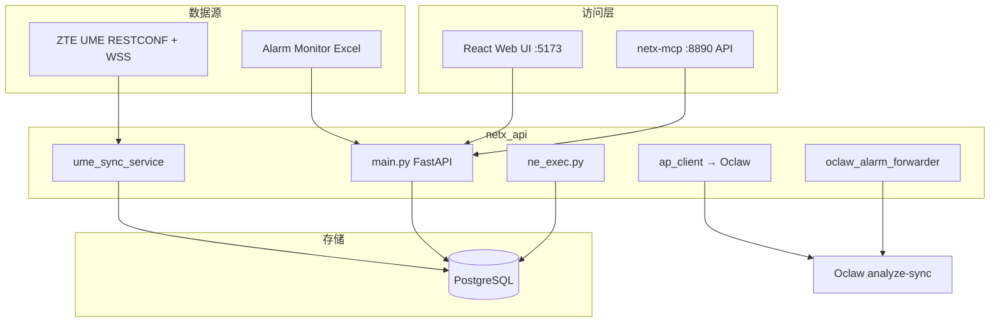

---

## 5. Oclaw ↔ netx 双向集成

### 5.1 三个集成方向

| 方向 | 机制 | 用途 |
|------|------|------|
| Oclaw → netx | MCP（13 工具） | 运维专家查告警、网元、执行 CLI |
| netx → Oclaw | `POST /v1/ap/analyze` | Web UI 一键 AI 告警分析 |
| netx → Oclaw | WebSocket 告警推送 | 关键告警即时通知到渠道 |

### 5.2 集成时序

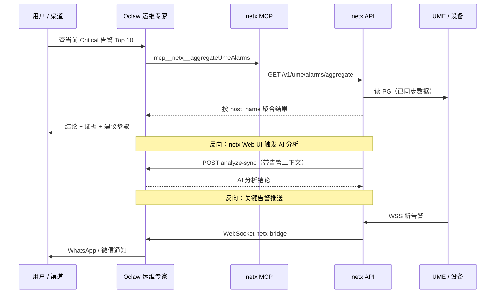

### 5.3 认证与环境变量

| 用途 | netx | Oclaw |
|------|------|-------|
| AI 分析桥 | `NETX_OCLAW_ANALYZE_TOKEN` | `OCLAW_OPS_AI_SHARED_TOKEN` |
| 告警 WS | `NETX_OCLAW_ALARM_WS_URL` | `ws://127.0.0.1:8787/ws/netx-bridge` |
| MCP 地址 | — | MCP env `NETX_API_URL=http://127.0.0.1:8890` |

详细说明见 [`docs/NETX_MCP_INTEGRATION.md`](../NETX_MCP_INTEGRATION.md)。

---

## 6. MCP 工具一览

在 Oclaw Admin 安装 MCP（`server_id=netx`）并绑定到 ops 专家后，工具以 `mcp__netx__<toolName>` 形式注入。

### UME 告警

| 工具 | 说明 |
|------|------|
| `queryUmeAlarms` | 分页查询当前告警 |
| `aggregateUmeAlarms` | 按维度聚合统计 |
| `runUmeDiagnostics` | 运行诊断规则 |

### UME 网元

| 工具 | 说明 |
|------|------|
| `queryUmeNeInventory` | 网元清单查询 |
| `getUmeNe` | 单个网元详情 |

### 深查分析

| 工具 | 说明 |
|------|------|
| `queryUmeAlarmsRaw` | 原始字段查询 |
| `aggregateUmeAlarmsRaw` | 原始字段聚合 |
| `listUmeAlarmFields` | 可用字段列表 |
| `sqlQueryUme` | 只读 SQL 查询 |

### 纳管网元 CLI

| 工具 | 说明 |
|------|------|
| `listManagedNe` | 列出纳管设备 |
| `getManagedNe` | 设备详情 |
| `execManagedNe` | 执行只读 CLI |
| `listCliTargets` | 可用 CLI 目标 |

---

## 7. 只读 CLI 安全模型

`ne_exec.py` 是 netx 设备自动化的安全核心，对应 MCP 工具 `execManagedNe`。

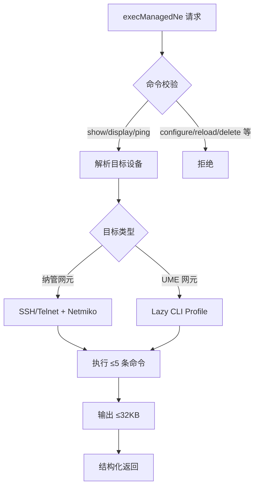

**约束摘要：**

- 允许前缀：`show`、`display`、`ping`、`ping6`
- 禁止：`configure terminal`、`reload`、`commit`、`delete` 等
- 单次最多 5 条命令，输出上限 32KB
- 凭证 Fernet 加密，需 `NETX_CREDENTIAL_SECRET_KEY`

---

## 8. Ops 专属 Playbook（Skills）

运维专家处理 netx 相关任务时，须加载对应技能：

| Skill | 路径 | 场景 |
|-------|------|------|
| `ops-netx-ume-playbook` | `skills/_workspace/ops/ops-netx-ume-playbook/` | UME 告警查询/聚合/诊断、网元清单 |
| `ops-netx-managed-ne-playbook` | `skills/_workspace/ops/ops-netx-managed-ne-playbook/` | 纳管设备 SSH/Telnet 只读巡检 |

所有专家也可使用的公共技能：

| Skill | 场景 |
|-------|------|
| `scheduled-workflows` | 周期性多步运维任务（告警周报 → PDF → 发群） |
| `channel-file-delivery` | CSV/PDF 报告通过渠道附件发送 |

Ops 私有技能安装目录：`skills/_workspace/ops/<name>/`（`public=false`）。

---

## 9. 自动化场景

### 9.1 定时告警周报

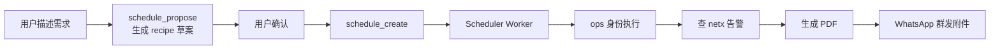

示例：「每周一 9:00 汇总上周值班告警，生成 PDF，发到 WhatsApp 群」

Recipe 自包含，worker 执行时不依赖原始聊天上下文；创建者专家（ops）的工具上下文会被继承。

### 9.2 关键告警实时推送

netx 匹配到关键告警后，经 WebSocket 推送到 Oclaw，再投递到已绑定的 **WhatsApp 告警群**（详见 [§10 WhatsApp 渠道应用](#10-whatsapp-渠道应用)）。

### 9.3 Web UI AI 分析

netx 前端 Workbench 可调用 `/v1/ap/analyze`，将告警上下文发给 Oclaw 运维专家做智能分析。

---

## 10. WhatsApp 渠道应用

WhatsApp 是运维场景中最常用的**移动端触达渠道**：值班人员可在群里直接问告警、收周报、收关键告警推送，无需打开 Admin 或 netx Web UI。

### 10.1 技术架构

当前默认链路为 **Baileys sidecar**（WhatsApp Web 协议），不依赖外部 openclaw 服务：

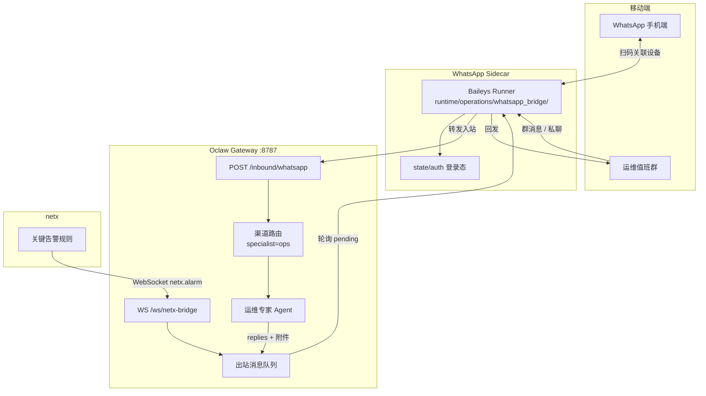

**关键路径：**

| 环节 | 端点 / 脚本 |
|------|-------------|
| 入站 | sidecar → `POST /inbound/whatsapp` → 返回 `replies[]` |
| 出站 | sidecar 轮询 `GET /whatsapp/outbound/pending` 并发送 |
| 登录态 | `data/channel_sidecar/whatsapp/state/auth/` |
| 扩展实现 | `runtime/extensions/whatsapp/` |

### 10.2 安装与设备绑定

```powershell
# 仓库根目录
powershell -ExecutionPolicy Bypass -File .\runtime\operations\scripts\whatsapp_install.ps1
powershell -ExecutionPolicy Bypass -File .\runtime\operations\scripts\whatsapp_login.ps1   # 控制台打印二维码
powershell -ExecutionPolicy Bypass -File .\runtime\operations\scripts\whatsapp_start.ps1
powershell -ExecutionPolicy Bypass -File .\runtime\operations\scripts\whatsapp_status.ps1
```

| 操作 | 说明 |
|------|------|
| 首次登录 | 手机 WhatsApp → 设置 → 已关联的设备 → 扫码 |
| 重启 sidecar | 一般无需重复扫码（登录态落盘） |
| 换号 / 解除关联 | 先 `whatsapp_stop.ps1 -Force`，删除 `state/auth`，再 `whatsapp_login.ps1` |
| 随全栈启动 | `scripts/start_all.ps1`（未安装 sidecar 时自动跳过并告警） |

### 10.3 路由到运维专家

在 Admin 将 WhatsApp 消息路由到 ops 专家，有两种配置入口：

| 配置位置 | 操作 |
|----------|------|
| **Stack 页面** | `WhatsApp dispatch` 控制卡 → 选「绑定专家」→ specialist 选 `ops` |
| **用户/渠道绑定** | `channel=whatsapp` → 按账号配置专家与模式 |

**交互模式：**

- **绑定专家（expert）**：所有消息直连 ops 运维专家（推荐运维群场景）
- **综合（comprehensive）**：经理 Agent 编排，网络任务委派给 ops

**优先级**：账号级配置 > 通道全局配置 > 默认（`expert + generalist`）

**用户归属绑定**（设备已连、需把联系人归属到团队用户）：

1. Admin → 用户/渠道绑定 → 渠道选 `whatsapp`
2. 生成绑定码，用户向机器人发送：`bind <绑定码>`

### 10.4 群聊触发策略

WhatsApp 群聊默认**不会响应每条消息**，避免群内噪声触发 Agent：

| 规则 | 默认值 | 环境变量 |
|------|--------|----------|
| 需要 @ 机器人 | 开启 | `AIA_WHATSAPP_GROUP_REQUIRE_MENTION=1` |
| 文本触发词 | `/oclaw`、`|oclaw` | `AIA_WHATSAPP_GROUP_TRIGGERS` |
| 会话作用域 | 按群隔离 | `AIA_WHATSAPP_GROUP_SESSION_SCOPE` |

```mermaid
flowchart TD
  A[群消息入站] --> B{是否 @ 了机器人?}
  B -->|是| C[进入运维专家处理]
  B -->|否| D{含触发词\n/oclaw 或 |oclaw?}
  D -->|是| C
  D -->|否| E[静默跳过]
  C --> F[查 netx / 生成报告 / 回复]
```

私聊消息不受 @ 限制，直接路由到绑定专家。

### 10.5 运维应用场景

#### 场景一：群内交互式运维

值班人员在 WhatsApp 群 @ 机器人提问，运维专家通过 netx MCP 查告警、聚合统计、执行只读 CLI：

```text
用户（群内）：@oclaw 查当前 Critical 告警 Top 5，按 host_name 排名

运维专家：
  1. 加载 ops-netx-ume-playbook
  2. mcp__netx__aggregateUmeAlarms(severity=critical, group_by=alarm_host_name)
  3. 返回结论 + 证据表格
```

#### 场景二：关键告警推送到值班群

netx 配置关键告警规则后，匹配到的告警实时推到 WhatsApp 群，无需人工刷新：

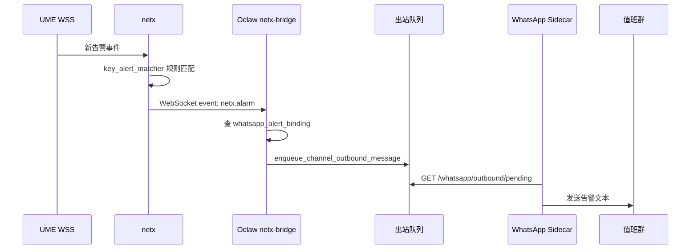

**告警消息格式示例：**

```text
[UME Alarm Raised] Fan
Device: ABC (1.1.1.1)
Object: ME{abc},FAN={/module=0}
Severity: major
Cause: Fan The fan speed level is abnormally high
Time: 2026-06-22T19:29:41.086+07:00
notificationId: 1680996323029
```

**Admin 配置告警群：**

1. 打开 Admin → WhatsApp 相关页面（或调用 API）
2. `GET /admin/api/whatsapp/groups` — 列出已知群（需 sidecar 运行且群内有消息）
3. `POST /admin/api/whatsapp/alert-binding` — 绑定 `group_jid` 并启用
4. `POST /admin/api/whatsapp/alert-binding/test` — 发送测试消息验证

#### 场景三：定时周报发到 WhatsApp 群

结合 `scheduled-workflows` + `channel-file-delivery` 技能：

```text
用户（群内）：每周一 9 点把上周告警汇总成 PDF 发到这个群

流程：
  1. schedule_propose → 生成自包含 recipe（含 netx 查询口径、PDF 路径、投递步骤）
  2. 用户确认 preview_markdown
  3. schedule_create(recipe=..., output.need_attachments=true)
  4. 到点 worker 以 ops 身份执行 → 查 netx → 生成 PDF
  5. save_deliverable_attachment → 投递到创建任务时的 WhatsApp 群
```

Recipe 中 `goal` 示例：

> 每周一 09:00 汇总上一自然周值班告警，生成 PDF 发到当前 WhatsApp 群并 @值班人

#### 场景四：附件报告投递

运维专家生成的 CSV / Excel / PDF 不会自动发出，须调用 `save_deliverable_attachment`：

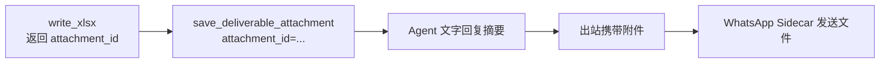

限制：每轮回复通常只发**第一个** deliverable 附件（约 8MB 上限）。

### 10.6 访问控制

Admin 可配置 WhatsApp 联系人白名单/黑名单（`GET /admin/api/whatsapp/access`），控制哪些号码可与机器人交互。未绑定用户的消息按访问策略处理。

### 10.7 相关环境变量

| 变量 | 说明 |
|------|------|
| `AIA_WHATSAPP_ACCOUNT_ID` | 账号 ID，默认 `wa-default` |
| `AIA_WHATSAPP_GROUP_REQUIRE_MENTION` | 群聊是否要求 @ 机器人 |
| `AIA_WHATSAPP_GROUP_TRIGGERS` | 群聊文本触发词 |
| `OCLAW_OPS_AI_SHARED_TOKEN` | netx-bridge 认证（告警推送） |
| `NETX_OCLAW_ALARM_WS_URL` | netx 侧告警 WS 地址 |

---

## 11. 部署与启用

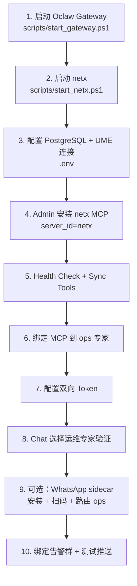

| 步骤 | 命令/配置 |
|------|-----------|
| Oclaw | `powershell -File scripts/start_gateway.ps1 -Background` |
| netx | `powershell -File scripts/start_netx.ps1` |
| MCP | Admin → MCP Servers → 粘贴 `netx/mcp.json` |
| Token | `OCLAW_OPS_AI_SHARED_TOKEN` ↔ `NETX_OCLAW_ANALYZE_TOKEN` |
| 验证 | Chat 选 ops → 「查当前 UME Critical 告警 Top 5」 |
| WhatsApp | `whatsapp_install.ps1` → `whatsapp_login.ps1` → `whatsapp_start.ps1` |
| 路由 ops | Admin Stack → WhatsApp dispatch → 绑定专家 `ops` |
| 告警群 | Admin → 绑定 `group_jid` → `alert-binding/test` |

一键运维栈：`scripts/start_ops.ps1`（Oclaw + netx）；全栈含渠道：`scripts/start_all.ps1`。

---

## 12. 总结

| 维度 | 要点 |
|------|------|
| Oclaw | 多专家 AI 平台，提供交互、编排、渠道 |
| netx | 告警数据面 + 安全设备 CLI 执行 |
| 运维专家 | 证据驱动、netx 深度集成、结构化 Playbook |
| 集成契约 | MCP 13 工具 + 双向 API（分析 / 告警推送） |
| 自动化 | 定时工作流 + 渠道附件 + 实时告警通知 |
| WhatsApp | 移动端运维入口：交互查询、告警推送、周报投递 |

**访问地址：**

- Oclaw Admin：`http://127.0.0.1:8787/admin`
- Oclaw Chat：`http://127.0.0.1:8787/chat`
- netx Web UI：`http://127.0.0.1:5173`
- netx API：`http://127.0.0.1:8890`

---

## 相关文档

- [`README.md`](../../README.md) — Oclaw 快速开始
- [`docs/NETX_MCP_INTEGRATION.md`](../NETX_MCP_INTEGRATION.md) — netx MCP 集成
- [`docs/ARCHITECTURE_OVERVIEW.md`](../ARCHITECTURE_OVERVIEW.md) — Oclaw 架构
- [`docs/RUNBOOK.md`](../RUNBOOK.md) — 部署与渠道配置（§4.2 WhatsApp）
- [`runtime/extensions/whatsapp/README.md`](../../runtime/extensions/whatsapp/README.md) — WhatsApp 扩展说明
- [`skills/_workspace/public/channel-file-delivery/SKILL.md`](../../skills/_workspace/public/channel-file-delivery/SKILL.md) — 渠道附件发送
- [`skills/_workspace/public/scheduled-workflows/SKILL.md`](../../skills/_workspace/public/scheduled-workflows/SKILL.md) — 定时工作流
- [`netx/README.md`](../../../netx/README.md) — netx 项目说明
- [`netx/docs/MCP.md`](../../../netx/docs/MCP.md) — netx MCP 工具文档
